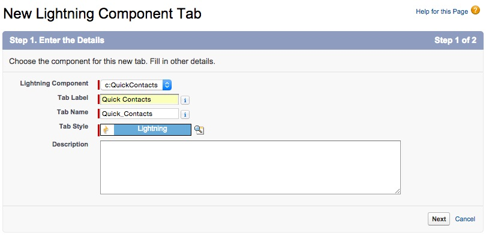
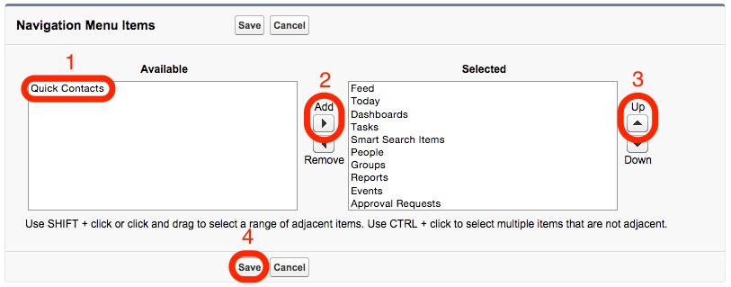
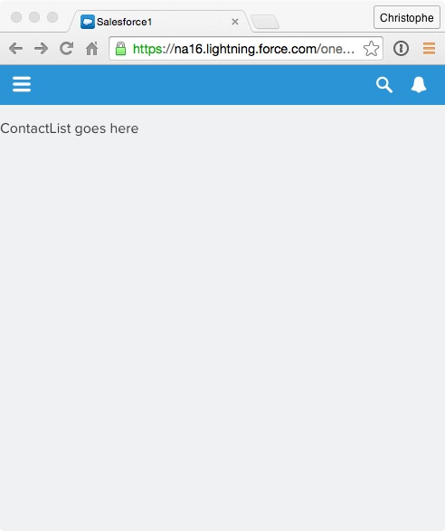

In this module, you create the QuickContacts Lightning Component.

## What you will learn
- Create a Lightning Component in the Developer Console
- Preview your Lightning Component in the Salesforce1 Application


## Step 1: Create the Component

1. In the Developer Console, click **File** > **New** > **Lightning Component**. Specify **QuickContacts** as the bundle name and click **Submit**

2. Implement the component as follows:

    ```
    <aura:component implements="force:appHostable">

        <p>ContactList goes here</p>

    </aura:component>
    ```

    ### Code Highlights:
    - The component implements the **force:appHostable** interface to indicate that it can run in the Salesforce1 application
    - Lightning components can include other Lightning components and regular HTML markup

1. Click **File** > **Save** to save the file


## Step 2: Create a Tab

1. In Setup, click **Create** > **Tabs**

1. In the **Lightning Component Tabs** section, click **New**

    
    - Select **c:QuickContacts** as the Lightning Component
    - Specify **Quick Contacts** as the Tab Label and **Quick_Contacts** as the Tab Name
    - Click the magnifier icon and select **Lightning** as the tab icon

1. Click **Next** and **Save**


## Step 3: Add the Tab to Mobile Navigation

1. In Setup, Select **Administer** > **Mobile Administration** > **Mobile Navigation**

    
    - Select **Quick Contacts** in the **Available** list
    - Click **Add**
    - Select  **Quick Contacts** in the **Selected** List, and click the **Up** button to move the tab up in the menu order
    - Click **Save**


## Step 4: Preview the Component in the Salesforce1 Application

1. In Salesforce, modify the URL as follows:

    
    - Remove the part of the URL that comes immediately after salesforce.com
    - Append /one/one.app to the URL immediately after salesforce.com

    > This starts the Salesforce1 Application simulator

1. Click the menu button in the upper left corner

1. Select **Quick Contacts** in the menu

    

1. Preview the component

    

<div class="row" style="margin-top:40px;">
<div class="col-sm-12">
<a href="create-apex-controller.html" class="btn btn-default"><i class="glyphicon glyphicon-chevron-left"></i> Previous</a>
<a href="create-contactlist-component.html" class="btn btn-default pull-right">Next <i class="glyphicon glyphicon-chevron-right"></i></a>
</div>
</div>
